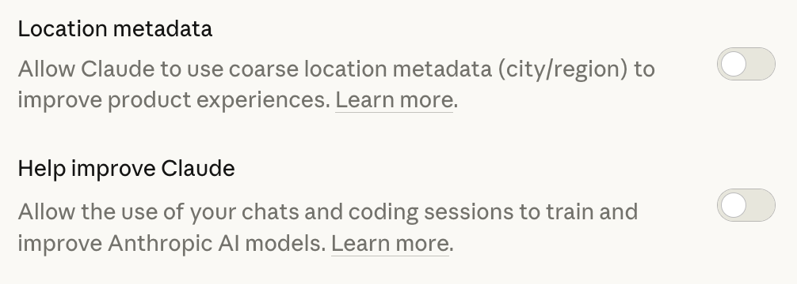

  

# Claude 註冊使用指南

本指南專為香港及澳門用戶而設，教你如何註冊並使用 Claude —— Anthropic 開發的 AI 助手。

> **注意：** 由於 Claude 目前未在香港及澳門地區正式開放，註冊過程需要一些額外步驟。本指南會詳細說明每一步操作。

---

## 目錄

- [一、事前準備](#一事前準備)
- [二、註冊流程](#二註冊流程)
  - [開啟 VPN](#第一步開啟-vpn)
  - [手機號碼驗證](#第三步手機號碼驗證)
- [三、訂閱計劃與支付](#三訂閱計劃與支付)
  - [Crypto 虛擬卡 + 手機錢包](#方式一crypto-虛擬卡--手機錢包)
  - [Gift Card 應用程式內購](#方式二gift-card-應用程式內購)
- [四、常見問題](#四常見問題)

---

## 一、事前準備

在開始註冊之前，請先準備好以下工具：

### 1. VPN 服務

由於 Claude 在香港及澳門不可直接使用，你需要一個 VPN（虛擬私人網絡）來連接到支援地區的伺服器。

- **甚麼是 VPN？** 簡單來說，VPN 可以讓你的網絡連接「假裝」來自其他國家，從而訪問該地區的服務。
- **推薦使用 [OpenHK](https://openhk.net/)：** 這是一款專為香港及澳門用戶訪問 Claude 和 ChatGPT 而優化的 VPN 服務。相比一般 VPN（如 Surfshark 等），OpenHK 的線路更不容易觸發 AI 平台的封鎖機制。此外，OpenHK 使用智能分流技術，只有 AI 服務的流量會經過 VPN，不影響其他本地服務的正常使用。
- **為甚麼不建議用普通 VPN？** 部分常見 VPN 的 IP 地址已被 Claude 識別並標記，使用後可能導致帳號被封鎖。選擇針對 AI 服務優化的 VPN 可大幅降低風險。

### 2. 電子郵箱

- 建議使用 Gmail（Google 郵箱），因為可以直接用 Google 帳號登入 Claude。

### 3. 可接收驗證碼的手機號碼

Claude 註冊時需要手機號碼驗證。香港及澳門的號碼**可能不被接受**，註冊流程中會使用接碼平台 [SMSPool](https://www.smspool.net/) 取得美國號碼（詳見[第三步](#第三步手機號碼驗證)）。

### 4. 支付方式（如需訂閱付費版）

如果你打算訂閱 Claude Pro 或 Max 計劃，可按以下優先順序選擇付款方式：

- **最佳方案：** 如果你持有由 Claude 支援地區（如美國、英國等）發行的 Visa / Mastercard 信用卡。
- **替代方案一：** 申請加密貨幣虛擬卡（詳見[方式一：Crypto 虛擬卡](#方式一crypto-虛擬卡--手機錢包)）。
- **替代方案二：** 購買 Gift Card 透過應用程式內購訂閱（詳見[方式二：Gift Card 內購](#方式二gift-card-應用程式內購)）。

### 5. 瀏覽器

- 推薦使用 Google Chrome 或 Firefox。
- 確保瀏覽器已更新至最新版本。

---

## 二、註冊流程

### 第一步：開啟 VPN

1. 打開 [openhk.net](https://openhk.net/)，點擊「Login」，使用 Google 帳號登入。
2. OpenHK 提供 3 日免費試用，無需即時付費。
3. 根據你的裝置系統（Windows / macOS / iOS / Android），選擇對應的「Setup Guide」。
4. 按照指引完成配置後，啟動連接。

> **建議：** 在註冊前，先將裝置的時區更改為 Claude 支援的國家或地區，例如「台北」（Taipei）。

### 第二步：訪問 Claude 網站並建立帳號

1. 打開瀏覽器，訪問 [https://claude.ai](https://claude.ai)。
2. 直接點擊「Continue with Google」。
3. 選擇你的 Google 帳號或登入 Google。
4. 授權 Claude 訪問你的 Google 帳號基本資料。

### 第三步：手機號碼驗證

Claude 註冊需要驗證手機號碼，香港及澳門號碼可能不被接受，建議使用接碼平台 [SMSPool](https://www.smspool.net/) 取得美國號碼：

1. 打開 [SMSPool](https://www.smspool.net/)，註冊一個帳號。
2. 登入後，點擊「Deposit」充值 3 美元（單次接碼費用約 $0.36，充值最低金額為 $3）。
3. 點擊「Quick Order」。
4. 在 Service 欄目搜尋「Claude」，選擇「ClaudeAI / Anthropic」。
5. 在國家列表中選擇「US - United States」，點擊發送按鈕取得號碼。
6. 將取得的美國號碼填入 Claude 註冊頁面，點擊「Send Code」。
7. 回到 SMSPool 頁面查看收到的驗證碼，填入 Claude 完成驗證。

> **提示：** 如果號碼被拒絕，嘗試重新取得另一個號碼即可。

### 第四步：完成註冊

1. 驗證成功後，你會被引導至 Claude 的主介面。
2. 你可能需要同意服務條款。
3. 關閉「Help improve Claude」。
4. 點擊左下角頭像，進入 Settings → Privacy，關閉「Location metadata」。

   

5. 完成！你現在可以開始使用 Claude 了。

---

## 三、訂閱計劃與支付

### 準備工作：取得美國地址

建議在 Google Maps 搜尋「Portland, Oregon」，選取一個地址並記下街道、城市、州和郵遞區號（Oregon 為免稅州，可避免額外消費稅）。

由於香港及澳門發行的信用卡**無法直接在官網訂閱** Claude，可透過以下兩種方式付款：

### 方式一：Crypto 虛擬卡 + 手機錢包

透過加密貨幣虛擬卡綁定手機錢包，在 Claude 官方網站付款。

**第一步：取得 Crypto 虛擬卡**

推薦以下平台，均可申請 Visa 虛擬卡：

- [Avalanche Card](https://www.avalanchecard.com/) — 支援 AVAX 生態
- [Ether.fi](https://www.ether.fi/) — 支援 ETH 生態

申請步驟：

1. 在上述平台註冊帳號並完成身份驗證（KYC）。
2. 使用加密貨幣充值所需金額。
3. 獲取虛擬卡號、到期日和 CVV。

**第二步：綁定手機錢包並付款**

- **iOS 用戶：** 將虛擬卡添加至 Apple 錢包，在 iPhone 的瀏覽器打開 [claude.ai](https://claude.ai)，即可使用 Apple Pay 完成付款。
- **Android 用戶：** 將虛擬卡添加至 Google Pay，在 Android 手機的瀏覽器打開 [claude.ai](https://claude.ai)，即可使用 Google Pay 完成付款。

> **提示：** 必須在對應系統的手機瀏覽器打開 claude.ai，才會出現 Apple Pay / Google Pay 付款選項。

### 方式二：Gift Card 應用程式內購

**iOS 用戶：**

1. 前往 [account.apple.com](https://account.apple.com)，點擊「Create Your Apple Account」，國家/地區選擇「United States」，電話驗證可使用香港（+852）或澳門（+853）號碼。
2. 在 App Store 登出現有帳號，登入新建的美國帳號。**注意：只在 App Store 中切換，不要在「設定」→「Apple ID」中登入，以免影響 iCloud 資料。**
3. 首次登入需填寫美國地址（使用上方準備工作中取得的地址），付款方式選「None」。
4. 購買美國 Apple Gift Card（可在 Amazon.com 或禮品卡代購平台購買），在 App Store 點擊頭像 →「Redeem Gift Card or Code」完成充值。
5. 在 App Store 下載 Claude App，登入 Claude 帳號，點擊「Upgrade」透過內購完成訂閱。
6. 訂閱完成後可切回香港/澳門帳號，已訂閱的服務不受影響。

**Android 用戶：**

1. 將 Google Play Store 的地區更改為美國（可參考 [Google 官方教程](https://www.youtube.com/watch?v=bq38Ms8yLak)），地址使用上方準備工作中取得的地址。
2. 地區更改後，綁定香港或澳門發行的 Visa / Mastercard 信用卡作為付款方式。
3. 在 Google Play Store 下載 Claude App，登入 Claude 帳號。
4. 在 App 內點擊「Upgrade」，透過 Google Play 內購完成訂閱。

---

## 四、常見問題

### 使用相關

**Q：每次使用 Claude 都需要開 VPN 嗎？**

A：是的。由於 Claude 在香港及澳門不可直接使用，每次訪問 claude.ai 時都需要開啟 VPN。

**Q：Claude 免費版有甚麼限制？**

A：免費版有每日訊息數量限制。當你達到限制時，需要等待一段時間才能繼續使用。升級到 Pro 或 Max 可以獲得更多額度。

**Q：我的帳號會被封禁嗎？**

A：只要你正常使用 Claude，一般不會被封禁。以下行為可能導致帳號被限制：
- 違反 Anthropic 的使用政策（如生成有害內容）。
- 短時間內大量發送請求。

### 安全建議

- **VPN 安全：** 選擇信譽良好的 VPN 服務商，或使用專為 AI 服務優化的 VPN（如 [OpenHK](https://openhk.net/)）。
- **支付安全：** 使用加密貨幣卡片支付時，只充值所需金額。

---

## 免責聲明

本指南僅供參考。Claude 的服務條款、支援地區和功能可能隨時變更，請以 [Anthropic 官網](https://www.anthropic.com) 為準。使用 VPN 和接碼平台時，請遵守當地法律法規。

---

> **最後更新：** 2026 年 4 月
